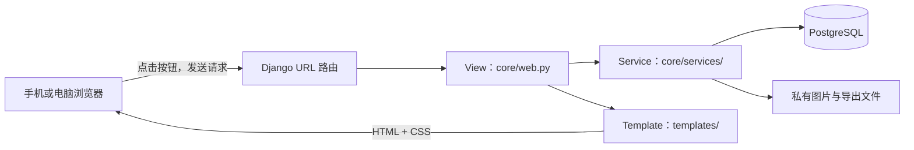
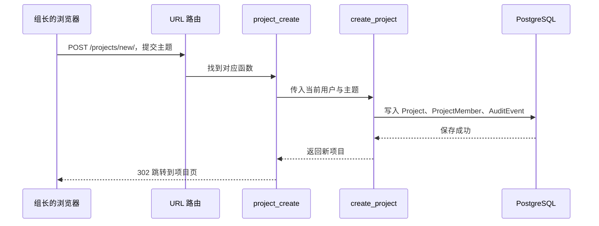
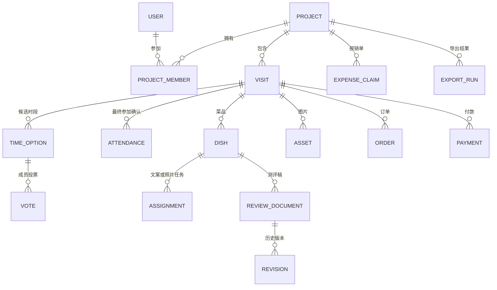

# 从零看懂吃乎项目是怎么开发的

这份讲解写给从未开发过 Web 应用的社团同学。读完不要求你立刻会写代码，而是希望你能回答四个问题：一个按钮按下后代码去了哪里、数据存在哪里、为什么有的操作只有组长能做、怎样安全地修改和验证项目。

本篇解释的是**当前仓库中的实际实现**。规划文档可能记录过不同设想；若文字与代码不一致，以正在运行的代码和测试为准。初读时先看第 1～5 节，再打开页面对照；后面的章节可以按兴趣阅读。

## 1. 先用一句话认识这个系统

吃乎是一个用 Python 和 Django 编写的社团测评网站。组长创建项目和到店活动，成员投票、确认参加、认领菜品文案和照片；组长审核、汇总内容与报销材料。电脑和手机访问的是同一个网站，页面布局会随屏幕宽度变化。

可以把它想象成四层：

| 层 | 它做什么 | 项目中的位置 |
| --- | --- | --- |
| 浏览器页面 | 显示内容、收集点击与输入 | `templates/`、`static/` |
| Web 入口 | 接收请求，决定调用哪个功能并返回页面 | `config/urls.py`、`core/urls.py`、`core/web.py` |
| 业务规则 | 判断“能不能做、做完会怎样” | `core/services/` |
| 数据存储 | 长期保存项目、成员、文案、费用等 | `core/models.py`、PostgreSQL、私有图片目录 |



这里的 *View* 是 Django 对“处理一次网页请求的 Python 函数”的名称；不是数据库里的“视图”。*Template* 是含有少量占位符的 HTML。*Service* 是本项目放业务规则的地方。

## 2. 写这个项目之前，先确定了什么

开发不是先画按钮，而是先弄清楚社团工作的边界。原流程散落在微信群、问卷星、共享文档、秀米和报销表里；这个系统把它们按“项目”串起来。设计阶段主要做了三件事：

1. **明确对象**：一个项目可以有多次到店；每次到店有自己的投票、名单、菜品、照片、订单和付款。同一家店去两次，也不能把两次记录混在一起。
2. **明确角色和权限**：同一个人在项目 A 可以是组长，在项目 B 可以是组员；权限跟项目绑定，不靠页面上写着“组长”来判断。
3. **明确完成条件**：投票不等于确认参加，上传照片不等于完成照片任务，导出报销包不等于已经报销。

想看原始设计，可依次阅读 [产品方案](product-plan.md)、[数据与权限约定](domain-contract.md)、[样例分析](sample-analysis.md) 和 [开发验收记录](development-log.md)。这些文档解释“为什么这样做”；本篇下面解释“代码如何做到”。

把开发过程按顺序想象，会更容易理解每份代码从何而来：先把社团流程和样表拆成明确的对象与规则；再在 `models.py` 建数据结构和迁移；接着在 `services/` 实现投票、任务、费用等规则；然后接上 URL、View 和页面；最后写自动测试、用手机和电脑试用，并准备运行与备份方式。真实开发中会反复返回前面修改，不是每一步只做一次。

## 3. 完全不懂代码时，先认识 8 个词

- **前端**：你在浏览器里看到并操作的页面。HTML 决定有哪些内容，CSS 决定长什么样，少量 JavaScript 处理浏览器内交互。
- **后端**：服务器上的 Python 程序。它检查权限、处理数据、生成页面和文件。
- **HTTP 请求**：浏览器与后端的一次对话。打开页面通常是 `GET`；提交表单通常是 `POST`。
- **URL 路由**：把网址匹配到一个 Python 函数。例如 `/tasks/` 对应任务中心。
- **数据库**：长期保存结构化数据的地方。这里正式方案用 PostgreSQL；它存项目、投票、任务状态等，不直接当图片相册用。
- **模型（Model）**：Python 对数据库表的描述。例如 `Project` 表示项目，`Visit` 表示一次到店。
- **迁移（Migration）**：数据库结构变更记录。新增模型字段后，需要生成并执行迁移，数据库才会真的多一列。
- **测试**：自动模拟用户和业务操作，确认改动没有破坏原有规则。

网页返回的状态码也不用怕：`200` 表示成功显示，`302` 表示让浏览器跳到另一个地址，`400` 常表示输入不合规则，`403` 表示没有权限，`404` 表示没有找到，`409` 常表示编辑时发生了版本冲突。看到错误时先记下状态码和正在做的操作，再去对应 View 和 Service 查原因。

请把“网站”“服务器”“数据库”分开理解：网站是用户体验，Django 是处理请求的程序，PostgreSQL 是持久保存记录的程序。它们互相配合，但不是同一个东西。

## 4. 项目文件地图

第一次打开仓库，可以按下面顺序看，不用从每个文件第一行读到最后一行。

```text
eatful/
├─ manage.py                 Django 命令入口
├─ pyproject.toml            Python 依赖、测试和代码格式规则
├─ config/
│  ├─ settings.py            数据库、登录、文件、时区等配置
│  └─ urls.py                网站总路由
├─ core/
│  ├─ models.py              数据结构
│  ├─ urls.py                业务页面路由
│  ├─ web.py                 普通网页的请求处理函数
│  ├─ api.py、api_urls.py    为未来集成保留的 /api/v1 接口
│  ├─ web_finance.py         费用网页入口
│  ├─ web_exports.py         导出网页入口
│  ├─ web_recognition.py     图片识别网页入口
│  ├─ services/              真正的业务规则
│  ├─ migrations/            数据库结构历史
│  └─ management/commands/   worker、提醒扫描等命令
├─ templates/                HTML 页面
├─ static/                   CSS、浏览器 JavaScript、社团 Logo
├─ tests/                    自动化测试
├─ compose.yaml、Dockerfile  服务器容器部署
└─ docs/                     需求、使用、部署与本讲解
```

一个常见误解是“`web.py` 有按钮，所以所有逻辑都写在 `web.py`”。实际不是：`web.py` 主要负责取出表单输入、调用 `services/`、选择返回哪个页面。这样普通网页和未来的 API 可以复用同一套业务规则。

## 5. 跟着一次点击，完整走一遍代码

假设组长在首页填写“校园周边火锅”，点击“创建项目”。

1. [首页模板](../templates/core/home.html) 中的 `<form method="post" action="...">` 把主题发给后端。`` 是防止其他网站冒用你的登录状态提交表单的令牌。
2. [业务路由](../core/urls.py) 把 `POST /projects/new/` 交给 `project_create`。
3. [网页处理函数](../core/web.py) 用 `request.POST.get("title", "")` 读取主题，调用 `projects.create_project(...)`。
4. [项目服务](../core/services/projects.py) 检查主题不是空白，在一个数据库事务中创建 `Project`，同时建立“创建者是组长”的 `ProjectMember`，并写审计记录。
5. 函数返回后，浏览器被重定向到新项目的 `/projects/<项目ID>/`。该页面再从数据库读取项目，填进 [项目模板](../templates/core/project.html)。



`302` 不是错误，它表示“请浏览器打开另一个地址”。如果输入无效，业务层会抛出 `ValidationError`；[中间件](../core/middleware.py) 会把它显示为错误页面，而不是悄悄保存坏数据。

账号由管理员批量导入，应用不开放注册。账号导入与项目大厅加入规则详见 [部署交接说明](handoff.md)。

可以用这个办法读任何功能：**先在模板里找按钮的 `action`，再在 `core/urls.py` 找对应名称，再看 View 调用了哪个 Service，最后看它修改了哪个 Model**。

第一次读 Python 时，不妨看项目服务里的这段真实代码：

```python
@transaction.atomic
def create_project(user, title, description=""):
    if not title.strip():
        raise ValidationError("请输入项目主题")
    organization, _ = Organization.objects.get_or_create(
        slug="eatful", defaults={"name": "Eatful 社团"}
    )
    obj = Project.objects.create(
        organization=organization, title=title.strip(), description=description, created_by=user
    )
    ProjectMember.objects.create(project=obj, user=user, role=ProjectMember.Role.LEADER)
    AuditEvent.objects.create(
        project=obj, actor=user, action="project.created", target_type="Project", target_id=obj.id
    )
    return obj
```

`def` 定义一个函数，括号里的 `user` 和 `title` 是调用者传来的信息；`if` 检查主题；`raise` 表示不符合规则就停止并报错；`get_or_create(...)` 找到或建立社团组织；`Project.objects.create(...)` 往数据库写一条项目记录；`return` 把新项目交回网页处理函数。最上面的 `@transaction.atomic` 保证这组写入要么一起成功，要么一起撤销。`ProjectMember` 把创建者设为组长，`AuditEvent` 留下操作记录；[原文件](../core/services/projects.py) 里还有其他项目相关函数。

## 6. 数据到底怎样组织

本项目最重要的关系是“项目包含多次到店”：



所有这些结构都定义在 [models.py](../core/models.py)。读模型时重点看三样东西：

- `ForeignKey`：表示“属于谁”。例如 `Visit.project` 说明这次到店属于哪个项目。
- `Status`：表示对象处在哪个状态。例如任务有“待认领、进行中、待审核、已通过”等状态。
- `UniqueConstraint`：由数据库保证“不允许重复”。例如同一菜品的同一种任务只能有一条。

每条主要记录使用 UUID 作为 ID，因此网址中的项目 ID 看起来像一长串字母数字。ID 只是定位记录，不是权限凭证；用户即使猜到别人的 ID，也必须经过权限检查。

图片原件不存进普通网页的 `static/`。数据库中的 `Asset` 记录图片归属、类型、摘要和私有文件路径；原图放在私有媒体目录，通过带权限检查的下载接口读取。`static/` 只放对所有访问者都可公开的 CSS、Logo 等页面资源。

## 7. 为什么“当前只显示一个任务节点”

到店活动的**数据库状态**与页面显示的**工作流节点**有关，但不是同一个字段。

| 数据库里的 `Visit.status` | 页面显示的节点 | 下一步怎么来 |
| --- | --- | --- |
| `draft`、`polling` | 时间投票 | 生成候选时段，成员逐个投票 |
| `confirming` | 确认参加 | 选出时间后，成员再确认是否参加 |
| `scheduled` | 到店准备 | 线下到店、保存菜单与照片 |
| `done` 且仍有未结束菜品任务 | 菜品测评 | 认领、投稿、上传、审核 |
| `done`，至少有一个选中菜品且其任务都已结束 | 本次到店完成 | 项目进入下一次到店或总稿 |

[workflow.py](../core/services/workflow.py) 的 `visit_step()` 根据数据库里的活动与任务状态算出**当前显示什么**；[到店页面](../templates/core/visit.html) 用 `` 只渲染对应节点。其余节点的数据没有被删除，只是当前页不把所有表单一起堆出来。

投票全部完成，或投票截止时间已过时，`sync_visit()` 会按“能参加人数优先，其次待定人数，平局取较早时段”选出时间，转为 `confirming`。所有在项目内的活跃成员都确认，或确认截止时间已过时，转为 `scheduled`。组长也能提前选时段或完成确认。**没有候选时段时不会自动选出一个凭空的时间。**

为什么使用 `transaction.atomic` 和 `select_for_update()`？可以把它们理解成“对这一小段数据库操作加保护”：两个用户几乎同时投完票，也不会都把同一活动推进一次。是否推进由页面访问和后台扫描共同检查；[scan_reminders.py](../core/management/commands/scan_reminders.py) 会定时扫描，避免只有打开页面时才更新。

项目级别还有另一条进度：所有到店完成后整理总稿，总稿定稿后整理报销材料，正式报销导出完成后项目工作流显示完成。这个计算在 `project_step()`；它与组长手动设置的项目“筹备/进行中/待收尾/归档”状态不同。

## 8. 角色权限不是靠隐藏按钮

在 [access.py](../core/services/access.py) 中，`membership(user, project)` 检查当前用户是否属于这个项目；`leader(user, project)` 进一步检查是否是该项目组长。创建活动、邀请成员、审核任务、导出报销等操作在服务端调用这些检查。

页面隐藏某个按钮，只是减少误操作和界面噪音。真正的保护在后端：别人即使自己拼出 POST 地址，也不能越权执行。项目 ID 与菜品、图片、订单之间的归属关系也要检查，防止把项目 A 的图片挂到项目 B。

例如 [dishes.py](../core/services/dishes.py) 中，认领菜品任务前会确认成员已经正式答复“参加”这次到店；提交文案任务前要有自己的原始测评，提交照片任务前要有与菜品关联的图片。组长审核通过才算完成。这个规则不能只靠网页提示，因为网页输入可以被伪造。

付款和票据图片还有更严格的读取权限：提交者和本项目组长能看；其他组员不能直接通过图片地址读取。相关规则在 `can_read_asset()` 中。

## 9. 其他功能分别是怎样做的

**共同写稿。** [documents.py](../core/services/documents.py) 保存文案时要求带上“我编辑时看到的版本号”。若别人已经保存了更新版本，系统返回冲突，让用户比较，而不是覆盖对方的文字。每次成功保存都新增一条 `Revision`；恢复旧版本也会产生新版本。评论和修改建议单独保存。Markdown 预览会经过清理，避免把任意 HTML 当作安全内容执行。

**上传图片。** [files.py](../core/services/files.py) 检查图片类型、尺寸和大小，生成缩略图，计算 SHA-256 摘要并拒绝同一活动中的重复图片。原图通过私有下载接口提供，不应把 `media/` 直接暴露为静态目录。

**菜单/付款图片识别。** 这是可选辅助能力。配置外部图像服务后，上传菜单或付款图可进入数据库里的 `Job` 队列，由 [worker](../core/management/commands/run_worker.py) 异步处理，再由人校对结果；没有配置时可手工建菜品、订单和付款。识别结果不能无条件当成真实账单。

**费用和报销。** [finance.py](../core/services/finance.py) 分开记录订单、订单行、优惠、付款、退款和付款对订单的分配。金额用 `Decimal`，因为普通小数运算容易产生金额精度误差。报销导出在 [exports.py](../core/services/exports.py)：先核对缺件和差额，再生成包含 Excel、原始凭证与索引的 ZIP。导出是当时数据的快照；后续修改订单不会悄悄改掉已经生成的文件。

**内容导出。** [content_export.py](../core/services/content_export.py) 汇总文案和选中的照片，生成供后续排版使用的内容包。系统目前不自动发布到微信公众号或小红书。

**站内提醒。** [reminders.py](../core/services/reminders.py) 根据缺项和截止状态生成去重的提醒；“已读”只是看过提醒，不代表任务已完成。目前不是向微信群自动发消息。

## 10. 为什么同一套代码能同时适合手机和电脑

[base.html](../templates/base.html) 放全站导航和页面公共结构。各页面模板决定内容；[style.css](../static/style.css) 和 [brand.css](../static/brand.css) 决定布局与颜色。

关键是 CSS 的响应式规则。例如在宽屏时，项目页有主内容和侧栏；到较窄的屏幕时改成单列。桌面宽屏显示左侧导航，手机显示底部导航。页面内容仍由同一个 Django View 提供，并不是维护两套项目数据。

```css
/* 这是原理示例，不是从项目中逐字复制的代码。 */
.layout { display: grid; grid-template-columns: 1fr 320px; }
@media (max-width: 820px) {
  .layout { grid-template-columns: 1fr; }
}
```

`@media` 的意思是“当屏幕满足这个宽度条件时，改用另一组样式”。它解决的是排版，不会自动保证按钮好点、表单好填，因此手机和电脑都需要实际检查。

## 11. 在自己的电脑上怎样安全地看和运行

当前这台 Windows 电脑有专用的 `eatful-local` Conda 环境和独立 PostgreSQL 数据库。**不要为了学习而删除 `.work/`、`media/` 或数据库；它们可能包含你已创建的项目与上传的图片。**

在项目根目录打开 PowerShell，可以用已有脚本启动 Web：

```powershell
& .\.work\run-local.ps1 -Role web
```

然后打开 `http://127.0.0.1:8000/`。如果需要图片识别后台任务和定时提醒，在另外两个终端分别运行：

```powershell
& .\.work\run-local.ps1 -Role worker
& .\.work\run-local.ps1 -Role scheduler
```

`.work/run-local.ps1` 是这台电脑的本地辅助脚本，里面写着本机 Conda 和 PostgreSQL 路径；它位于被 Git 忽略的目录，不代表换一台电脑也能直接运行。通用安装方法在根目录 [README](../README.md)。`--noreload` 模式下改了 Python 代码后要重启 Web 进程；改 CSS 后刷新浏览器，若仍是旧样式可强制刷新。

在**另一个** PowerShell 终端中，先给管理命令设置与本地启动脚本相同的环境变量，再运行三个常用的验证命令（先确保本地 PostgreSQL 已启动）：

```powershell
$env:DJANGO_DEBUG = '1'
$env:DATABASE_URL = 'postgresql://eatfuldev@127.0.0.1:5543/eatful_local'
.\.venv\Scripts\python.exe manage.py check
.\.venv\Scripts\python.exe manage.py makemigrations --check --dry-run
.\.venv\Scripts\python.exe -m pytest -q
```

`check` 检查 Django 配置；`makemigrations --check --dry-run` 检查模型改动是否缺迁移，不会应用迁移；`pytest` 创建隔离测试数据库运行测试，**不是在正常业务数据上“试一遍”**。测试前要确保项目配置连接的是本地测试用 PostgreSQL，而不是生产库。改数据库结构时，`migrate` 会真的修改所连接的数据库，不能把它当成无害的查看命令。

## 12. 测试如何证明一个功能可靠

[tests/test_journey.py](../tests/test_journey.py) 是一条很好的阅读线索：它模拟登录、创建项目、到店投票、确认、菜品认领、写稿、上传图片、费用记录与报销导出。你可以把它看成“电脑自动扮演一次组长”。

[tests/test_workflow.py](../tests/test_workflow.py) 则专门检查投票齐全和截止时间能否推进节点，以及页面是否只展示当前节点。其他测试分别检查权限、文案冲突、图片、金额核对、后台任务、提醒和 API。

自动测试的边界也要知道：它能检查规则和页面是否正常返回，却不能证明按钮在 375px 手机屏上一定好点、导出的纸质表格一定符合某次真实报销要求，更不能代替真实社团成员试用。因此开发过程是“写功能 → 自动测试 → 浏览器试用 → 根据反馈修改”。

## 13. 如果你想亲手改一个小功能

建议从低风险的文字和样式开始，暂时不要改数据库或费用计算。

**练习 A：改首页说明文字。** 打开 [home.html](../templates/core/home.html)，找到你在浏览器里看到的“从这里开始”，改成自己的文案，保存并刷新页面。这个练习让你理解模板和浏览器的关系。

**练习 B：改桌面卡片间距。** 打开 [brand.css](../static/brand.css)，找到 `.brand-project-grid` 的 `gap`。小幅调整后，在浏览器的电脑和手机尺寸各看一次。这个练习让你理解同一页面为何有不同排版。

**练习 C：顺着代码追一条规则，不急着改。** 找到到店页“认领”按钮的 `action` → 在 [core/urls.py](../core/urls.py) 找 `assignment-claim` → 在 [core/web.py](../core/web.py) 找 `assignment_claim` → 在 [dishes.py](../core/services/dishes.py) 找 `claim()`。试着指出“只有已确认参加的成员可认领”在哪一行被检查。

学会这三个练习后，再尝试“新增一个业务字段”：先更新 Model，再生成迁移，再改 Service、View、Template，最后补测试。不要直接改数据库表或仅在 HTML 里加输入框；那样数据未必能保存，权限也可能漏掉。

## 14. 继续学习时，按这个顺序

1. **HTML/CSS 基础**：理解标签、表单、类名、网格和媒体查询。直接对照 `templates/core/home.html` 与 `static/brand.css`。
2. **Python 基础**：函数、条件、列表、字典、异常。对照 `core/services/workflow.py`。
3. **Django 四件套**：URL、View、Template、Model。用第 5 节“创建项目”的路径反复练。
4. **数据库关系**：理解主键、外键、唯一约束和事务。对照 `core/models.py`。
5. **安全与测试**：理解登录、项目权限、CSRF、文件私有访问、自动化测试。对照 `core/services/access.py` 和 `tests/`。
6. **部署**：最后再读 `compose.yaml` 和 [部署文档](deployment.md)。开发机上的 `runserver` 只用于本地学习；服务器用 Gunicorn、PostgreSQL、反向代理和 HTTPS。

不必一次记住所有类名。你已经能在浏览器完成一个动作时，只需问自己：**这个表单在哪里？URL 指向谁？规则在哪里检查？改了哪条数据？哪个测试能证明它有效？** 能沿着这五问找到答案，就已经真正开始看懂这个项目了。
